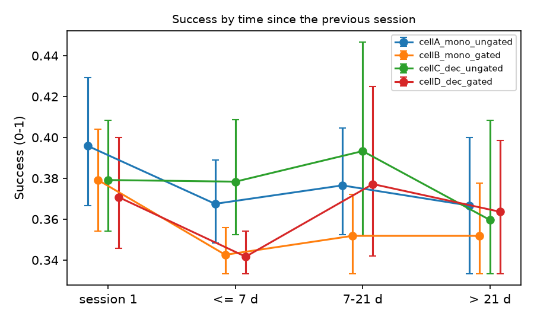

# Memory metrics without a model - v3_50

## 1. Success Rate by time since the previous session

Judge Success per session (0-1), grouped by the gap before it. 95 % CI: bootstrap over profiles.

| arm | memory | session 1 | <= 7 d | 7-21 d | > 21 d |
|---|---|---|---|---|---|
| base_instruct | none | 0.383 [0.358, 0.408] (n=40) | - | - | - |
| cellA_mono_ungated | needstate | 0.396 [0.367, 0.429] (n=40) | 0.368 [0.348, 0.389] (n=39) | 0.377 [0.353, 0.405] (n=27) | 0.367 [0.333, 0.400] (n=15) |
| cellB_mono_gated | needstate | 0.379 [0.354, 0.404] (n=40) | 0.343 [0.333, 0.356] (n=36) | 0.352 [0.333, 0.372] (n=27) | 0.352 [0.333, 0.378] (n=18) |
| cellC_dec_ungated | needstate | 0.379 [0.354, 0.408] (n=40) | 0.378 [0.352, 0.409] (n=37) | 0.393 [0.352, 0.447] (n=25) | 0.360 [0.333, 0.408] (n=19) |
| cellD_dec_gated | needstate | 0.371 [0.346, 0.400] (n=40) | 0.342 [0.333, 0.354] (n=40) | 0.377 [0.342, 0.425] (n=19) | 0.364 [0.333, 0.399] (n=22) |
| reactive_baseline | none | 0.388 [0.367, 0.412] (n=40) | - | - | - |
| sft_with_thoughts | none | 0.392 [0.362, 0.421] (n=40) | - | - | - |

## 2. Re-proposal of denied inferences

Dialogue level: a supporter inference (>= L2) answered by an explicit seeker denial, and later supporter turns of the same profile containing 60 % of the denied sentence's content words. Lexical heuristic: a lower bound, for comparing arms. Recorded: nodes the need-state memory marked disconfirmed.

| arm | memory | sessions | denials detected | denials re-proposed | re-proposing turns (cross-session) | memory nodes | disconfirmed nodes | re-proposed after disconfirmation |
|---|---|---|---|---|---|---|---|---|
| base_instruct | none | 40 | 0 | 0 | 0 (0) | 0 | 0 | 0 |
| cellA_mono_ungated | needstate | 121 | 0 | 0 | 0 (0) | 0 | 0 | 0 |
| cellB_mono_gated | needstate | 121 | 0 | 0 | 0 (0) | 0 | 0 | 0 |
| cellC_dec_ungated | needstate | 121 | 0 | 0 | 0 (0) | 239 | 0 | 0 |
| cellD_dec_gated | needstate | 121 | 0 | 0 | 0 (0) | 242 | 0 | 0 |
| reactive_baseline | none | 40 | 0 | 0 | 0 (0) | 0 | 0 | 0 |
| sft_with_thoughts | none | 40 | 0 | 0 | 0 (0) | 0 | 0 | 0 |

Every detected denial, with its claim and any re-proposals, is in `denials.jsonl`.

