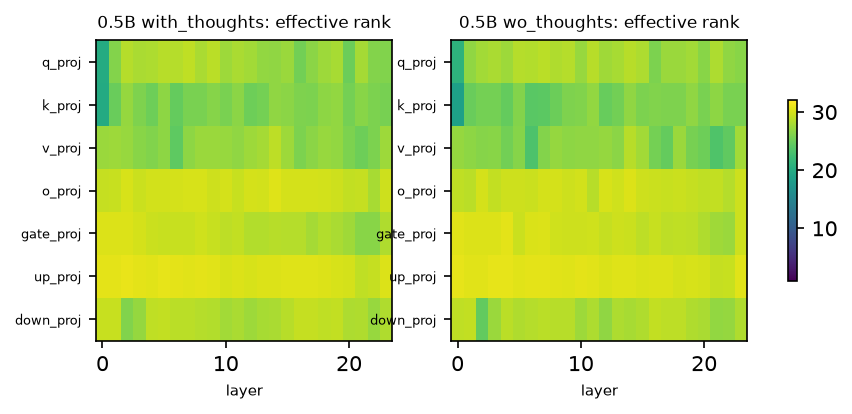
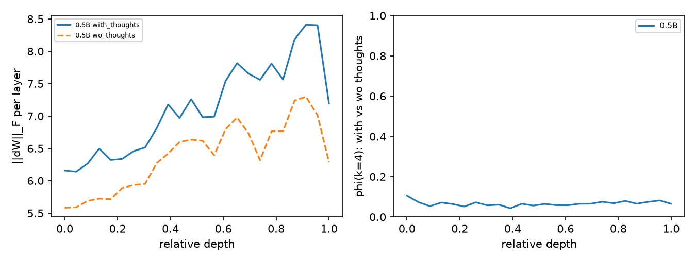
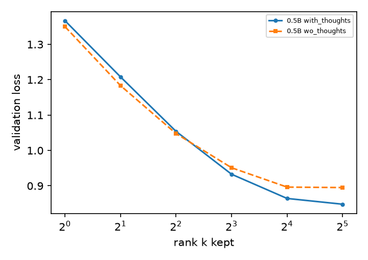

# Geometry of the LoRA updates

Per adapted matrix dW = s B A: singular values from the r x r core. Effective rank = exp(entropy of the normalized singular values), out of r = 32. Norm share = fraction of the summed ||dW||^2 in the first, middle and last third of the layers.

| size | arm | mean ||dW||_F | stable rank | effective rank (/32) | energy in top 4 | norm share early/mid/late |
|---|---|---|---|---|---|---|
| 0.5B | with_thoughts | 2.1911 | 6.84 | 28.15 | 43.1% | 26% / 34% / 40% |
| 0.5B | wo_thoughts | 1.9844 | 6.52 | 28.08 | 44.1% | 27% / 35% / 38% |

## Do the two arms move the same directions?

phi(k) = ||U_with[:, :k]^T U_wo[:, :k]||_F^2 / k over the top-k left singular vectors; 1 = same subspace, random subspaces give about k / d.

| size | phi(k1) | phi(k4) | phi(k8) | ||dW|| with / wo |
|---|---|---|---|---|
| 0.5B | 0.074 (random 0.0028) | 0.066 (random 0.0111) | 0.077 (random 0.0222) | 1.104 |

## Rank-k truncation (validation loss)

Every dW replaced by its best rank-k approximation (Eckart-Young); k = 0 is the base model. First 300 validation examples. 'k for 95 %' = smallest k recovering 95 % of the full adapter's loss drop.

| size | arm | k=0 | k=1 | k=2 | k=4 | k=8 | k=16 | k=32 | k for 95 % |
|---|---|---|---|---|---|---|---|---|---|
| 0.5B | with_thoughts | 1.8679 | 1.3669 | 1.2080 | 1.0540 | 0.9328 | 0.8643 | 0.8480 | 16 |
| 0.5B | wo_thoughts | 1.8736 | 1.3500 | 1.1834 | 1.0478 | 0.9511 | 0.8964 | 0.8951 | 16 |

