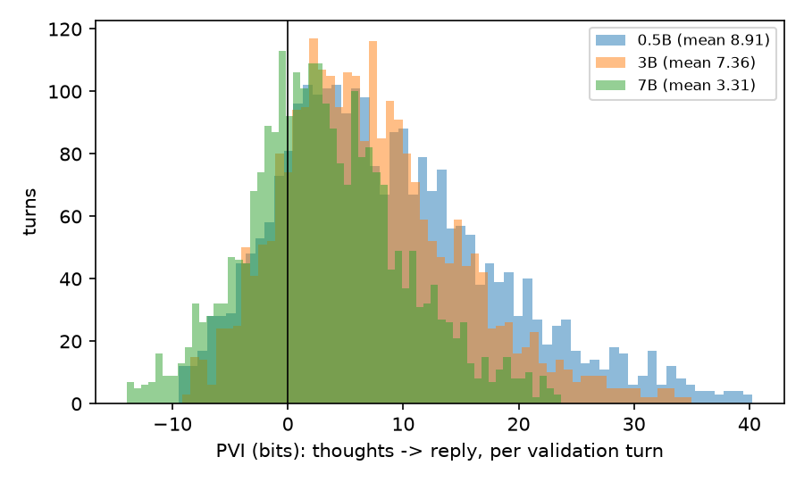
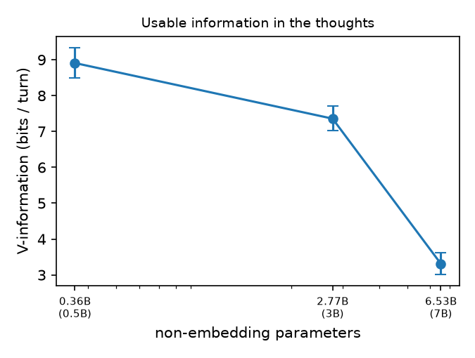

# Usable information in the thoughts (PVI) - val split

PVI = log2 p_with(reply | context, thoughts) - log2 p_wo(reply | context), per supporter turn; its mean is the V-usable information the gold Analysis/Strategy carry about the reply. 95 % CIs: bootstrap over profiles. Reply NLL is nats per reply token.

| size | turns | V-info (bits/turn) | bits/token | PVI < 0 | reply NLL with | reply NLL wo | rho(len, PVI) |
|---|---|---|---|---|---|---|---|
| 0.5B | 2608 | 8.908 [8.486, 9.341] | 0.238 | 17.9% | 0.727 [0.708, 0.745] | 0.891 [0.870, 0.914] | 0.155 |
| 3B | 2608 | 7.358 [7.019, 7.720] | 0.196 | 17.3% | 0.571 [0.558, 0.585] | 0.707 [0.692, 0.723] | 0.129 |
| 7B | 2608 | 3.311 [3.013, 3.621] | 0.088 | 32.9% | 0.434 [0.425, 0.443] | 0.495 [0.486, 0.504] | 0.100 |

**0.5B by ladder rung:** L0 -0.22 bits (n=4), L1 7.87 bits (n=1160), L2 9.76 bits (n=1444)

**3B by ladder rung:** L0 0.96 bits (n=4), L1 6.43 bits (n=1160), L2 8.12 bits (n=1444)

**7B by ladder rung:** L0 -1.80 bits (n=4), L1 3.10 bits (n=1160), L2 3.49 bits (n=1444)

Turns with PVI < 0 are listed in per_example_<size>.jsonl (sort by pvi_bits): annotations that made the gold reply less predictable are the first ones to audit.
