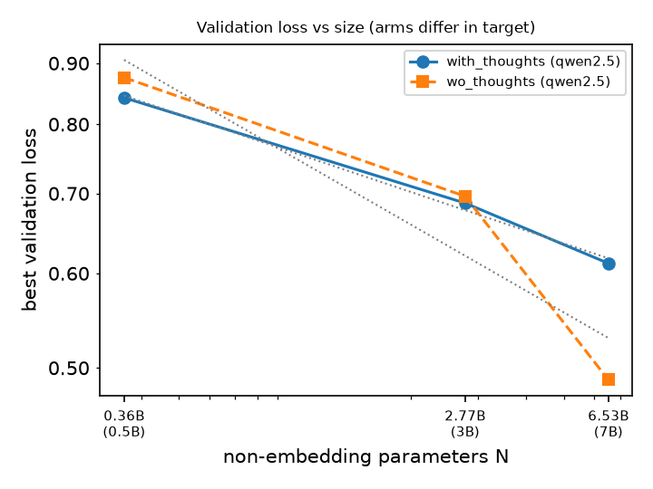
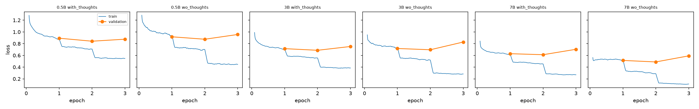
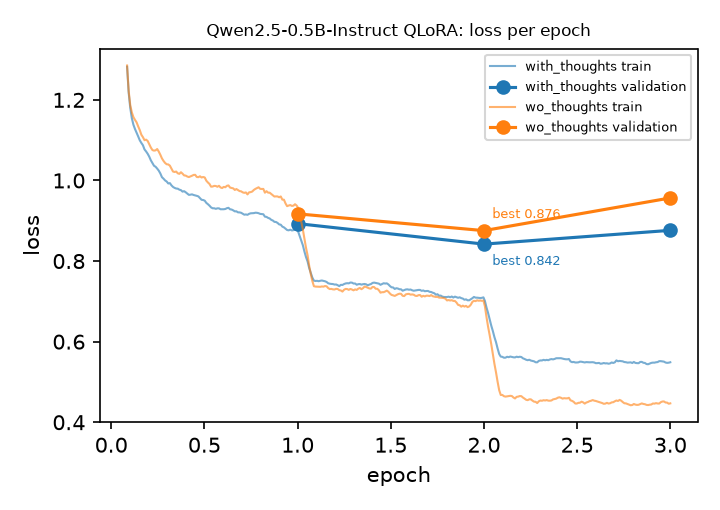
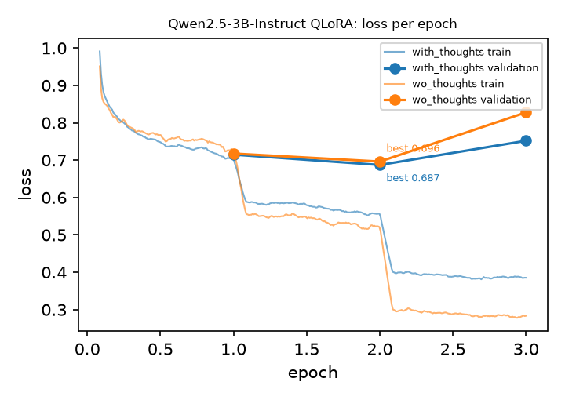
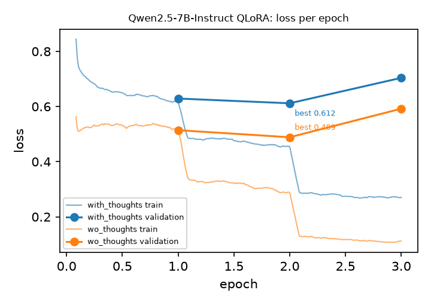
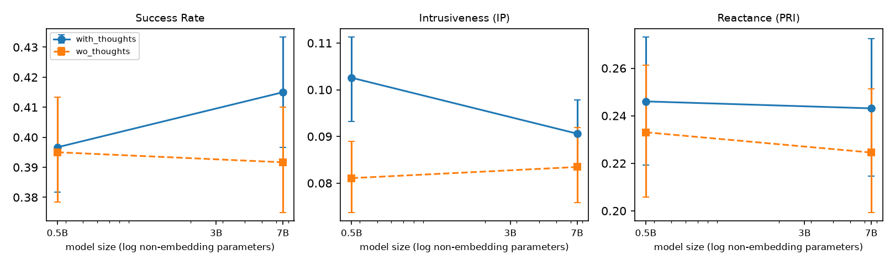
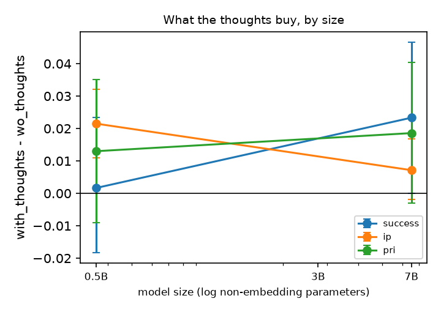

# Scaling study: Qwen2.5 0.5B / 3B / 7B, same QLoRA recipe, 1000-profile corpus

Qwen3 rows are controls for the self-generated data (Qwen2.5-7B wrote the corpus): same recipe, another family, so they are shown but never enter the fits or the per-decade slopes.

Test metrics: every size plays against the same Qwen2.5-7B seeker (scripts/scaling_eval.sh), scored by the Mistral-Nemo judge. Validation losses of the two arms are not comparable to each other (the with_thoughts target also holds the thoughts).

| size | arm | N (non-emb) | best val loss | best epoch | success | ip | pri | PRI (counterfactual) |
|---|---|---|---|---|---|---|---|---|
| 0.5B | with_thoughts | 0.36B | 0.8420 | 2 | 0.397 | 0.103 | 0.246 | 0.010 |
| 0.5B | wo_thoughts | 0.36B | 0.8755 | 2 | 0.395 | 0.081 | 0.233 | 0.006 |
| 3B | with_thoughts | 2.77B | 0.6872 | 2 | - | - | - | - |
| 3B | wo_thoughts | 2.77B | 0.6962 | 2 | - | - | - | - |
| 7B | with_thoughts | 6.53B | 0.6117 | 2 | 0.415 | 0.091 | 0.243 | 0.018 |
| 7B | wo_thoughts | 6.53B | 0.4886 | 2 | 0.392 | 0.083 | 0.225 | 0.010 |

- with_thoughts: best val loss ~ 7.14 N^-0.108 (1 residual df)
- wo_thoughts: best val loss ~ 34.8 N^-0.185 (1 residual df)
- reply NLL (with thoughts): b = 0.167, 95 % CI [0.162, 0.172] (bootstrap over validation profiles)
- reply NLL (wo thoughts): b = 0.187, 95 % CI [0.182, 0.191] (bootstrap over validation profiles)
- thoughts gain on success: 0.5B 0.002 [-0.018, 0.023]; 7B 0.023 [0.000, 0.047]
  - per decade of N: 0.017 [-0.008, 0.042]
- thoughts gain on ip: 0.5B 0.021 [0.011, 0.032]; 7B 0.007 [-0.002, 0.017]
  - per decade of N: -0.011 [-0.023, 0.000]
- thoughts gain on pri: 0.5B 0.013 [-0.009, 0.035]; 7B 0.019 [-0.003, 0.040]
  - per decade of N: 0.004 [-0.019, 0.027]

Every number is measured on simulated seekers and read by an LLM judge.
