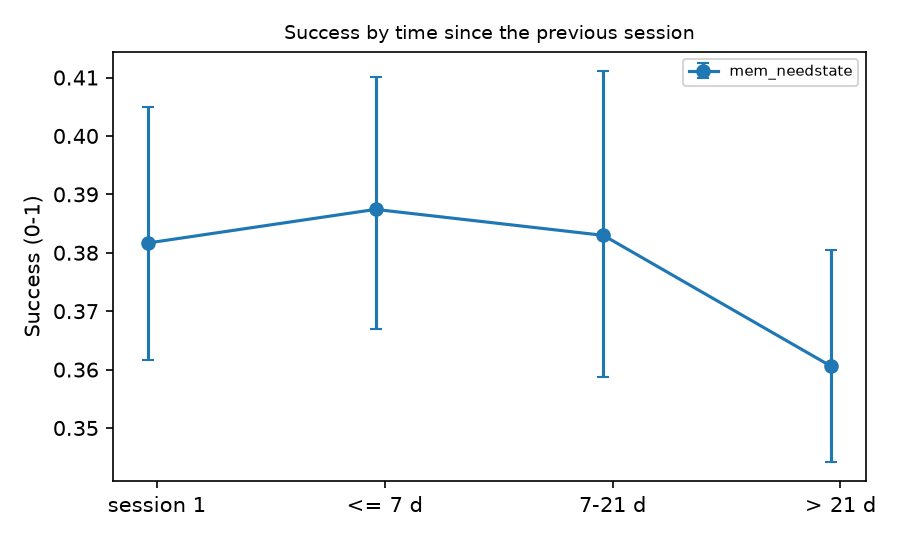

# Memory metrics without a model - memory_1000

## 1. Success Rate by time since the previous session

Judge Success per session (0-1), grouped by the gap before it. 95 % CI: bootstrap over profiles.

| arm | memory | session 1 | <= 7 d | 7-21 d | > 21 d |
|---|---|---|---|---|---|
| mem_needstate | needstate | 0.382 [0.362, 0.405] (n=100) | 0.387 [0.367, 0.410] (n=114) | 0.383 [0.359, 0.411] (n=47) | 0.361 [0.344, 0.380] (n=49) |

## 2. Re-proposal of denied inferences

Dialogue level: a supporter inference (>= L2) answered by an explicit seeker denial, and later supporter turns of the same profile containing 60 % of the denied sentence's content words. Lexical heuristic: a lower bound, for comparing arms. Recorded: nodes the need-state memory marked disconfirmed.

| arm | memory | sessions | denials detected | denials re-proposed | re-proposing turns (cross-session) | memory nodes | disconfirmed nodes | re-proposed after disconfirmation |
|---|---|---|---|---|---|---|---|---|
| mem_needstate | needstate | 310 | 0 | 0 | 0 (0) | 633 | 0 | 0 |

Every detected denial, with its claim and any re-proposals, is in `denials.jsonl`.

